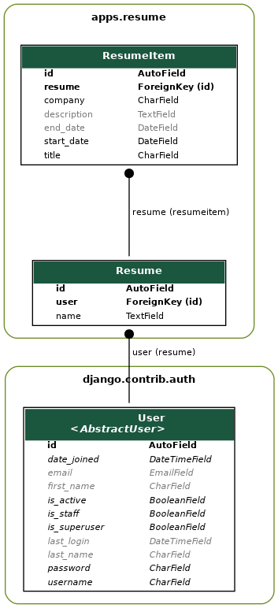

# Architecture Decisions

## Models

Figure \ref{models} shows the relevant model relationships of the resume application.
One resume consists of many resume items, and every user can have more than one resume.

There were two choices for how to relate the user to the resume.
The first is the way that it currently is: a foreign key from the resume table to the user table.
The alternative would have been to create an intermediary table, `ResumeUser`, which would point to a `Resume` and a `User`.

The benefits of an in-between table are that it makes the architecture very flexible, at the expense of complex querying.
With the current set-up, if we decided that resumes aren't user-specific, we would have to remove the user link from the table, necessitating potentially expensive data migrations.
Additionally, extra information about the relationship can be stored in the intermediary table, although it's hard to think of even a contrived example of why that would be useful.

The downsides of an intermediary table are that it requires an extra two database joins per request and that it makes querying more complex.
In the case where we would allow the same resume to be shared amongst users, or if we needed to store information against the relationship, the trade-off would be worthwhile.
However, given that I could not think of a use-case where either would be useful, the intermediary table was the worse of the two options.

Resumes are user-specific: no user will have the same resume as anyone else.
Therefore there is no reason to not link a resume directly to the user.
This makes querying simpler, reduces the number of tables required, and is the simplest architecture for the use-case.

I would also not store the user's first name and last name separately.
Many cultures do not have the same name structures as we do, and the UX is better to have one text field.
However, those fields come from the default django auth model.
If this were a real-life app, I would have created a custom user model.
This is generally recommended as good practice, anyway, because changing to a custom user model later on is hard.

## URLs

The URL schema was pre-determined, but I would have structured it slightly differently by keeping `id` with the entity name.
For example, `resume/id/edit` instead of `resume/edit/id`.
This keeps the URL of entities and sub-entities consistent: `resume/resume_id/item/edit/item_id` is less consistent than `resume/resume_id/item/item_id/edit` because it introduces an extra keyword in-between the entity and id in one place, but not in another.
Whilst in this case the `resume_id` is redundant because the `item_id` is unique, it's not always guaranteed that the `id` of the sub-entity is unique amongst all sub-entities.
Therefore it's reasonable to always have the ids of every entity in the URL so the URL consumer does not have to know about the uniqueness of the IDs when making a request, and so their experience is consistent and requires minimal thought and manual reading.

One could argue that every sub-entity should have a unique ID, but that's not always possible and is an unnecessarily inflexible constraint.
This seems like the most extensible schema, and it's very little additional overhead.
Changing URLs, however, is expensive.

I was unsure about whether or not to pluralise the URLs when considering viewing all resumes, so `resumes` instead of `resume`.
Because changing URLs is expensive, and this was already there, it was sensisble to leave as-is.

## Views

The views follow a similar pattern to how they were originally designed.
A create endpoint to create the resume, an edit endpoint to rename it, and a view endpoint to look at it.

The resume item endpoints were changed to consume the `resume_id` from the URL.
There is now a check to ensure the resume for that ID exists, and that the item for that resume exists.
This is important because if there was no check the user could call `resume/bad_id/item/id`, and end up changing the item of the wrong resume.
This means an extra database call per request.
If that becomes problematic, it's easy to optimise into one database call.
Keeping them separate for now, though, is fine, because it's easier to read and the app has no users.
